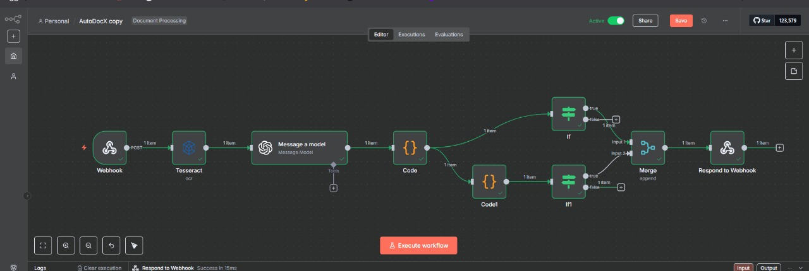
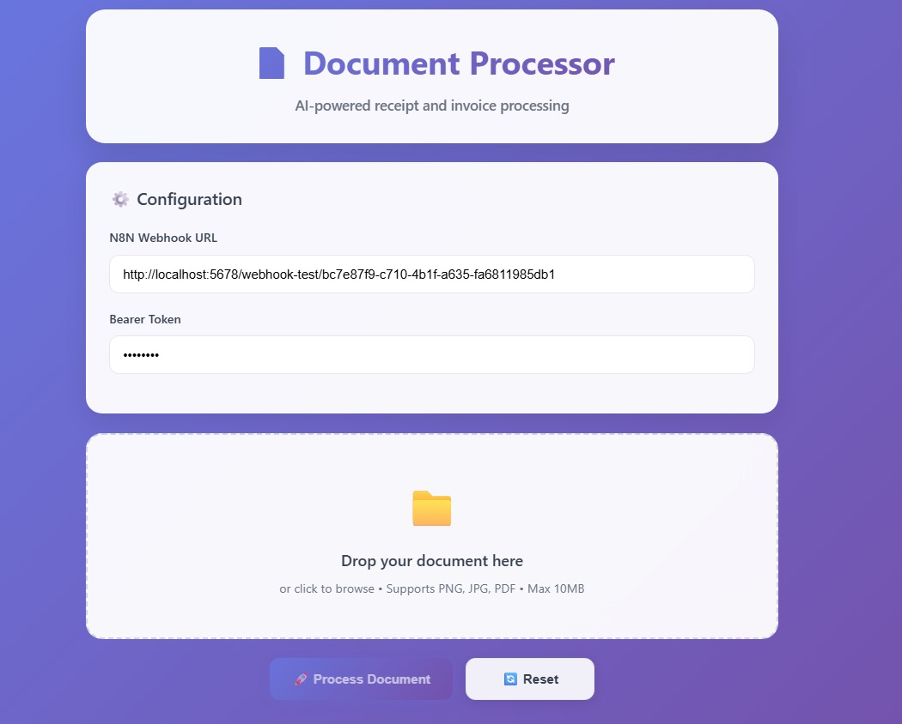

# AutoDocX: AI-Powered Document Data Extraction

This project features a sleek front-end interface connected to a powerful **n8n** backend for intelligently extracting structured data from documents like invoices and receipts.

---

## ✨ About The Project

AutoDocX provides a complete solution for document processing. The system is comprised of:

-   **A modern front-end** built with HTML, CSS, and vanilla JavaScript where users can securely configure the backend endpoint and upload documents.
-   **A robust n8n workflow** that orchestrates AI-powered data extraction and validation.

After uploading an image and clicking **"Process Document"**, the request is sent to the n8n workflow. In under a minute, the extracted data is returned and displayed in a beautifully formatted and easy-to-read table.

---

## 🚀 Demo

Click the image below to watch a demo video of the application in action. The video (`demo_video.mp4`) is located in this repository.

*Note: You may need to update the path to your video file if you change its name or location.*

---

## 🛠️ Tech Stack

-   **Frontend:** HTML, CSS, Vanilla JavaScript
-   **Backend Automation:** [n8n](https://n8n.io/)
-   **OCR Engine:** [Tesseract.js](https://tesseract.projectnaptha.com/)
-   **AI Language Model:** [OpenAI (GPT-4o)](https://openai.com/)
-   **Core Logic & Validation:** [Node.js](https://nodejs.org/) (within n8n Code nodes)

---

## ⚙️ Architecture & Workflow Overview

The entire data processing pipeline is orchestrated within a single n8n workflow, ensuring modularity and scalability.

*(You can add a screenshot of your n8n workflow here.)*
``

1.  **Ingestion Endpoint:**
    -   A `Webhook` node acts as the entry point, listening for `POST` requests from the front-end containing the document file.

2.  **OCR Processing:**
    -   The `Tesseract` node receives the file and performs Optical Character Recognition to convert the image into raw text.

3.  **AI-Powered Data Structuring:**
    -   The extracted text is sent to an `OpenAI` node, where a sophisticated prompt instructs the GPT-4o model to parse the text and return a structured JSON object.

4.  **Validation & Routing:**
    -   `Code` nodes receive the AI's response, clean it, and perform rigorous validation against a set of business rules (e.g., required fields, numeric formats, and amount calculations).
    -   `If` nodes route the data based on its validity.

5.  **Response:**
    -   The `Respond to Webhook` node sends the final, structured, and validated JSON data back to the front-end for display.

---

## Setup & Installation

### Backend (n8n)

1.  **Import the Workflow:**
    -   Download the workflow `.json` file from this repository.
    -   In your n8n instance, go to `Workflows` and click `Import from File`.
    -   Select the downloaded JSON file.

2.  **Configure Credentials:**
    -   Find the **OpenAI** node in the workflow.
    -   Create new credentials and add your OpenAI API key.

3.  **Activate the Workflow:**
    -   Save and activate the workflow. Copy the **Webhook URL** for the production environment.

### Frontend

1.  Open the `index.html` file in your browser or serve it from a local web server.
2.  Paste your n8n Webhook URL and a bearer token (if you configured one) into the **Configuration** section.
3.  You are now ready to process documents.

---

## ⚖️ License

This project is licensed under the MIT License. See the [LICENSE](LICENSE) file for details.
